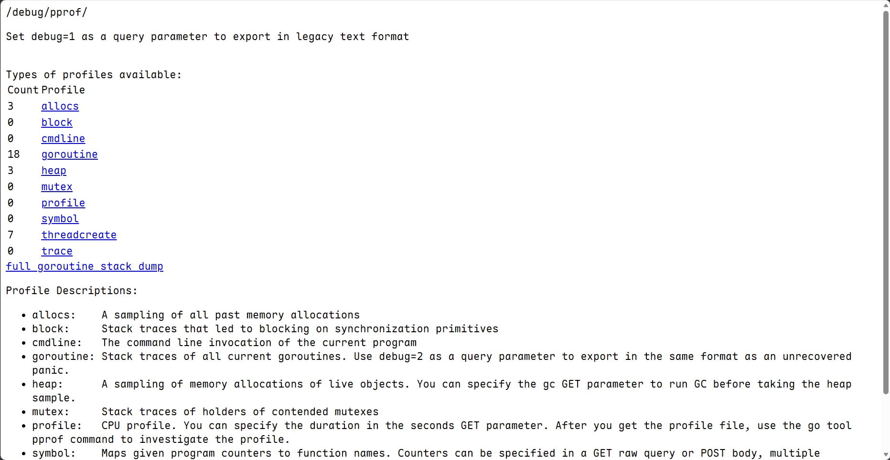

对于go语言的pprf分析我们有两种情况，一个是针对长期开启的服务进行探测，还有一种是针对脚本进行分析

## 针对服务型

我们可以在代码中使用 `net/http/pprof` 包。你只需要在代码中匿名引入，它会自动在 `8080`（或其他你定义的）端口开启一个 `/debug/pprof` 路由。

```go
// 在main函数中启动
go func() {
   http.ListenAndServe("localhost:6060", nil)
    }()
```

这样go会在`6060`端口下打开一个网页(~~虽然很简陋~~)，访问`http://localhost:6060/debug/pprof/`就可以看到这样一个的分析



## 脚本

对于脚本和一些简单go程序，会运行一段时间直接退出，这个时候就不适合打开端口监控了，我们可以直接在脚本中插入埋点

```go
package main

import (
    "os"
    "runtime/pprof"
    "runtime"
    "log"
)

func main() {
    // --- CPU Profile ---
    cpuFile, err := os.Create("cpu.prof")
    if err != nil {
        log.Fatal(err)
    }
    pprof.StartCPUProfile(cpuFile)
    defer pprof.StopCPUProfile()

    // 运行你的脚本逻辑
    runScriptLogic()

    // --- Memory Profile ---
    memFile, err := os.Create("mem.prof")
    if err != nil {
        log.Fatal(err)
    }
    defer memFile.Close()
    
    // 显式运行一次 GC，确保内存数据准确
    runtime.GC() 
    if err := pprof.WriteHeapProfile(memFile); err != nil {
        log.Fatal(err)
    }
}

func runScriptLogic() {
    // 模拟耗时或内存密集操作
    sum := 0
    for i := 0; i < 1000000; i++ {
        sum += i
    }
}
```

这个时候我们运行结束后会发现目录下多了`cpu.prof` 和 `mem.prof` 文件，我们使用pprf就可以进行分析：
```bash
go tool pprof cpu.prof
```

### 更推荐的测试方法

如果我们需要测试的内容可以封装为一个函数，那么使用 Go 的测试工具链进行性能分析是最简单、最专业的做法， 不需要在业务代码里写任何 `pprof` 代码

我们需要编写一个benchmark文件
```go
package main

import "testing"

func BenchmarkMyTask(b *testing.B) {
    for i := 0; i < b.N; i++ {
        runScriptLogic() // 调用你要分析的函数
    }
}
```

然后通过 `test` 工具链对整个程序进行测试并生成分析
```bash
go test -bench . -cpuprofile cpu.prof -memprofile mem.prof
```

最后通过pprf进行分析
```bash
go tool pprof -http=:8080 cpu.prof // 在8080端口打开网页，需要安装Graphviz
```

