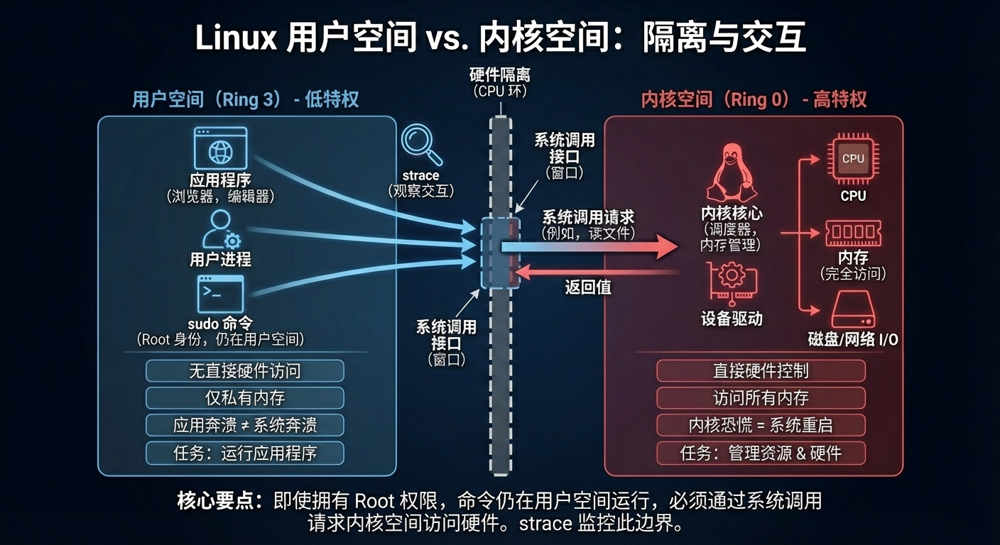

在 Linux 操作系统中，**用户空间 (User Space)** 和 **内核空间 (Kernel Space)** 是操作系统为了保证安全性和稳定性，在硬件（CPU）支持下进行的逻辑隔离

## 定义

**用户空间**  
用户空间是普通应用程序运行的地方，具有低特权级别，不能直接访问底层硬件和受保护的内存区域

**内核空间**  
内核空间是操作系统的核心（Kernel）运行的地方。它拥有最高特权，可以直接控制 CPU、内存、磁盘、网卡等所有硬件资源

## 异同

| **特性**   | **用户空间 **        | **内核空间**                     |
| -------- | ---------------- | ---------------------------- |
| **特权等级** | 低特权 (Ring 3)     | 高特权 (Ring 0)                 |
| **硬件访问** | 不允许直接访问，必须通过系统调用 | 可以直接访问 CPU、内存、I/O 等          |
| **内存分配** | 只能访问被分配的私有内存     | 可以访问整个物理内存                   |
| **奔溃后果** | 仅当前进程崩溃，系统依然稳定   | 可能导致内核恐慌 (Kernel Panic)，系统重启 |
| **主要任务** | 运行各类应用软件         | 资源调度、内存管理、硬件驱动、进程管理          |

## 误解:权限和空间

当我们使用 `root` 权限执行命令的时候，这个命令也是在用户空间操作的，而不是在内核空间下完成的

运行模式(即空间的划分)是在硬件层面的，两个空间就如同一个有窗户相隔的两个房间，代码的执行在用户空间进行，只是需要使用资源的时候通过窗户call一下内核空间，而不可能直接打破墙去内核空间操作

--- 

> [!note]
> 当然也有可以直接在内核空间操作的方法：
> - **编写并加载内核模块 (LKM)**：比如你写了一个 `.ko` 驱动文件，用 `insmod` 加载。这段代码会直接并入内核，拥有毁灭一切的权限。
> - **修改内核源码**：重新编译 Linux 内核（比如你打算给 Arch Linux 换个自定义内核）

## 查看内核空间命令

我们知道用户空间执行命令的时候会向内核空间请求和发送系统调用，内核处理完成后会返回给程序返回值，而我们可以使用[[系统调用追踪]]也就是`strace`来观察用户空间和内核空间的交互通信

