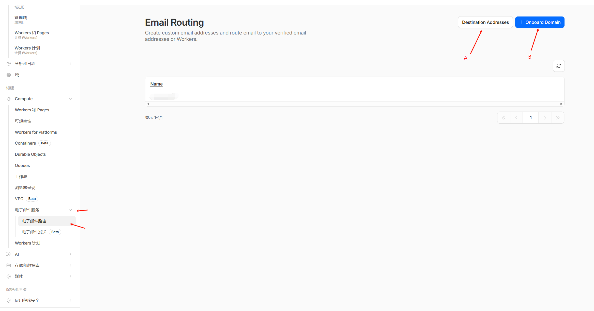
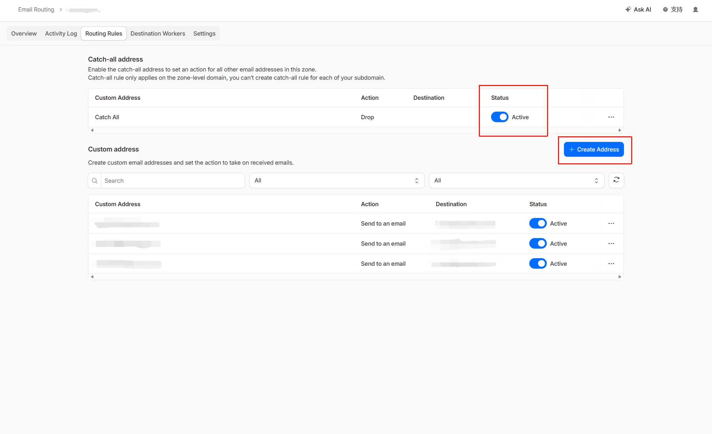

# 快速食用指南

1. 找个无限邮箱注册机构免费薅一些邮箱
2. 进入闲鱼，关键词: "business拼车"，"team拼车"
3. 选择价位 5-10 块钱的进行购买
4. 按操作食用

# 前情提要

偶然见看到了Cloudflare提供邮箱路由功能，所以突发奇想准备进行对爱国公司Openai进行羊毛攻击

在薅羊毛之前，你需要准备的东西:
- 一个域名,如果是.com的最好
-  Cloudflare账户

## 1.将域名由Cloudflare托管

- 你可以直接在Cloudflare注册域名，然后选择托管
- 如果你是在其他平台购买的域名，可以搜索域名转移，将域名转移到Cloudflare进行托管

## 2.为域名启动电子邮件路由功能

- A: 是你的接收邮箱，Cloudflare会将路由的邮件发送到这个邮箱，可以填多个
- B: 是你的域名

随后，在 Routing rules中选择status，打开后再create address，就是注册新的邮箱了,你可以将你新建的邮箱直接绑定你有的邮箱，这样就实现了邮箱的无限

--- 
> [!note]
> 这个路由是什么意思呢？其实就是等效与一个你自己的无限邮箱，在安全性方面是大于网络中的无限邮箱的，同时也方便管理，即用即丢，并且干净

---
随后就是和开头一样的注册账户，去闲鱼购买

祝你使用ai开心喵