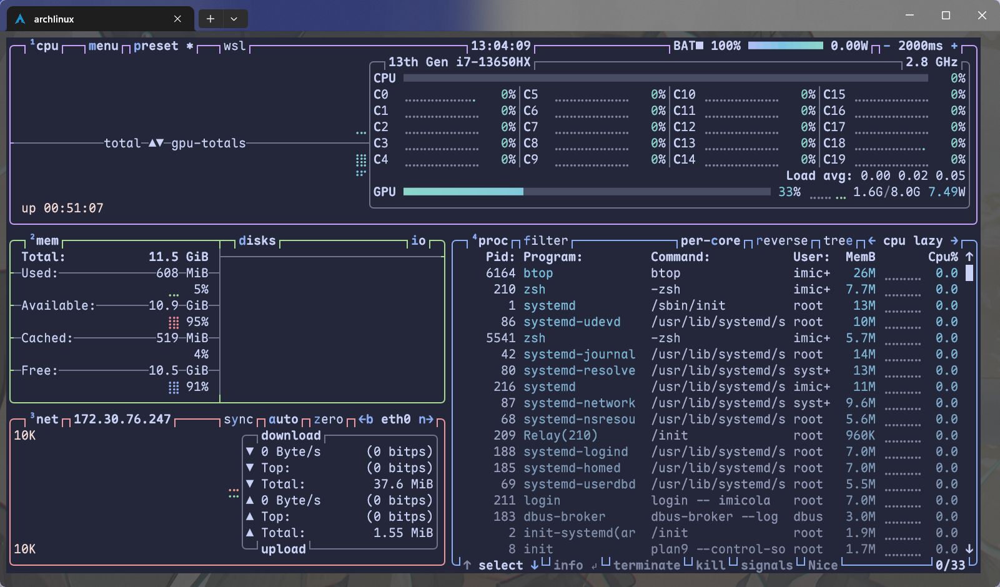

# 进程

进程是运行中的程序的实例，是操作系统进行资源分配和调度的基本单位，当然这些更加底层的事情我们会留到操作系统这门课的时候进行讲解

我们在window上可以通过任务管理器很轻松的看见运行在电脑上的进程，在linux中我们也有观察系统进程的工具

## Linux进程管理器

很多人会推荐 `htop` 这一个工具来进行进程管理，这个工具是[top](https://imicola.github.io/基础入门/MIT-Missing-Semester/性能分析#top)命令的改良，可以很方便的查看当前所有的进程以及系统CPU，内存占用等信息，而且其占用低

我更推荐 `btop` 工具，在功能性上其完全不输 `htop`，只需要付出一点点的占用代价就能获得更加直观与全面的分析，同时更加美观~~(颜值即实用)~~，可以通过 `btop` 界面上展示的快捷键快速对进程等系统资源进行操作与分析



~~真是美美又观观啊~~

## ps

ps（**p**rocess **s**tatus）是常用的输出进程状态的工具，直接调用 ps 仅显示本终端中运行的相关进程，如果要显示所有进程，对应命令是 `ps aux`

> 一点小技巧，你可以使用 `ps aux --sort=-%cpu`来对`ps`的输出进行CPU占用排序，这在cpu高占用排查和编写脚本的时候会很有用

## 进程标识符

对于操作系统中的每一个进程，都有一个唯一标识来区分这些进程，这个唯一表示即 **进程标识符PID**,当我们想挂起，继续，或者终止程序的时候，我们都需要使用 PID 作为索引

> [!tip]  
> 当我们观察按PID进行排序的界面时候，我们很难不注意到 PID 的排序总是遵循一种规律，比如 PID1 是 `systemd` ，PID2 是 `init-systemd`  
>  
> 这里其实涉及 PID 分配机制，其有两个特性
> - **顺序性**: 只要计数器没达到上限，新进程的PID总是比之前的大，系统内部维护一个计数器，每创建一个进程，这个计数器就+1并且将其分配给这个进程
> - **回绕**: Linux系统中有一个 `pid_max`，通常是32768或更高，当计数器达到这个上限后，系统便会回到这个低位寻找已经被注销的空闲PID进行重新分配
> 
> 有时候我们会注意到PID之间的跳跃，如从 PID8 到 PID42,然后又马上到180+
> 
> 这种情况有两个可能
> 1. 瞬时进程：在系统启动的时候会启动很多的脚本或者初始化任务，它们执行完后就消失了，但是其消耗了中间的 PID 计数
> 2. 多线程/子进程: 在一些现代软件和~~天才工程师~~的程序中，会fork出大量的子进程，这些进程会占用 PID

## 进程优先级与状态

其实你知道吗？一个CPU核心一次只能执行一个进程，而现代民用CPU一般就20多个核心，而电脑中进程动辄上百个，为了让这些进程看起来是在「同时」执行的，操作系统会用非常快的速度在这些进程中来回切换，而这也就引入了进程优先级和进程状态的概念

### 优先级与 nice 值

对于很多的程序来说，其各个占用的资源不同，所以需要一个设定来指定程序的**优先级**。在 `htop`和`top`中有两个与优先级有关的值 Priority(PRI) 和 nice(NI)

Nice值越高代表一个进程对其他进程越 *nice*(友好)，其对应的优先级也就越低。nice值最高为 19，最低为-20。通常来说程序的默认nice值应该都是0。我们可以通过 `htop`，`btop`等来调整进程的nice值

用户可以使用 `nice` 命令在运行程序时指定优先级，而 `renice` 命令则可以重新指定优先级。当然，若想调低 nice 值，还需要 `sudo`（毕竟不能随便就把自己的优先级设置得更高，不然对其他的用户不公平）。

### 进程状态

进程不是一直在系统中运行的，进程可以被简单的分为3类
- 运行态(Running): 即正在运行底层程序
- 就绪态(Ready)： 可以运行但是正在排队等待的程序
- 阻塞态(Blocked)： 正在等待其他资源(网络，磁盘等)而无法立刻开始运行的程序

而在linux中，系统对于进程的分类会更加复杂一些，下面表显示了进程状态

| 状态               | 缩写表示 | 说明          |
| ---------------- | ---- | ----------- |
| Running          | R    | 正在运行/可以立刻运行 |
| Sleeping         | S    | 可以被中断的睡眠    |
| Disk Sleep       | D    | 不可被中断的睡眠    |
| Traced / Stopped | T    | 被跟踪/被挂起的进程  |
| Zombie           | Z    | 僵尸进程        |

---

## 用户进程控制

控制进程的前提是与进程进行通话，由于进程之间不会共享内存空间，所以就无法直接发送信息，于是就需要操作系统的链接，因此，信号机制就产生了

### 信号

信号是 Unix 系列系统中进程之间相互通信的一种机制。发送信号的 Linux 命令叫作 `kill`。被称作 "kill" 的原因是：早期信号的作用就是关闭（杀死）进程。

下面是一些常用的信号：

| **信号名称** | **编号** | **默认动作** | **详细含义**                                                               |
| -------- | ------ | -------- | ---------------------------------------------------------------------- |
| **HUP**  | 1      | 终止       | **Hangup**:最初用于拨号终端断开。现在常用于通知守护进程**重新加载配置文件**（不重启进程）。                  |
| **INT**  | 2      | 终止       | **Interrupt**:来自键盘的中断信号，通常是用户按下了 **Ctrl+C**。                           |
| **QUIT** | 3      | 终止+Core  | **Quit**:类似 INT，但由 *Ctrl+\|* 触发，并且会生成 Core Dump 文件用于调试。                |
| **KILL** | 9      | 终止       | **Kill**：**强制杀死进程**。该信号不能被捕获、阻塞或忽略，进程无法在退出前进行清理。                       |
| **TERM** | 15     | 终止       | **Terminate**:**优雅退出**。这是 `kill` 命令默认发送的信号，它告诉进程“请你保存数据并关闭”，进程可以捕获并处理。 |
| **TSTP** | 20     | 暂停       | **Terminal stop**:用户通过 **Ctrl+Z** 发送的暂停信号，可以被捕获。                       |
| **CONT** | 18     | 继续       | **Continue**。让被暂停(STOP/TSTP)的进程恢复运行。由 `fg` 或 `bg`发出                    |

### 前后台切换

一般来说，我们创建的进程默认都是跑在前台，如果想要在程序运行的时候还可以做其他事情而不是看着程序跑，那我们就需要将程序放到后台来跑

在shell中输入命令的时候，我们可以在命令结尾添加`&`来告诉命令在后台运行

```bash
10:42:03 with imicola in ~ is 📦 None …
➜ ./test &
```

---

如果想让前台的程序切换到后台，我们需要按下Ctrl + Z发送 `SIGTSTP` 让进程挂起，再输入 `jobs` 命令，就可以看到被挂起的程序以及其代号


## 终止进程

### 终止前端进程

对于运行在前端的程序，我们只需要在终端界面按下 `Ctrl + c` 就会向程序发送 `SIGINT` 信号告诉程序需要退出

### xtop中发送信号

在所有类top命令中，一般都会有发送信号的方式，比如 `top` 和 `htop` 命令中，我们通过按下 `k` 键来向进程发送信号，在 `btop` 命令中，`kill`键将对选择的进程发送 `SIGTERM` 退出信号，`s`可以选择发送的信号

### kill

如前所述，Linux 上最常用的发送信号的程序就是 kill

```bash
[imicola@LAPTOP-1R3FN2QL ~]$ kill -l
 1) SIGHUP       2) SIGINT       3) SIGQUIT      4) SIGILL       5) SIGTRAP
 2) SIGABRT      7) SIGBUS       8) SIGFPE       9) SIGKILL     10) SIGUSR1
3) SIGSEGV     12) SIGUSR2     13) SIGPIPE     14) SIGALRM     15) SIGTERM
4) SIGSTKFLT   17) SIGCHLD     18) SIGCONT     19) SIGSTOP     20) SIGTSTP
5) SIGTTIN     22) SIGTTOU     23) SIGURG      24) SIGXCPU     25) SIGXFSZ
6) SIGVTALRM   27) SIGPROF     28) SIGWINCH    29) SIGIO       30) SIGPWR
7) SIGSYS      34) SIGRTMIN    35) SIGRTMIN+1  36) SIGRTMIN+2  37) SIGRTMIN+3
8) SIGRTMIN+4  39) SIGRTMIN+5  40) SIGRTMIN+6  41) SIGRTMIN+7  42) SIGRTMIN+8
9) SIGRTMIN+9  44) SIGRTMIN+10 45) SIGRTMIN+11 46) SIGRTMIN+12 47) SIGRTMIN+13
10) SIGRTMIN+14 49) SIGRTMIN+15 50) SIGRTMAX-14 51) SIGRTMAX-13 52) SIGRTMAX-12
11) SIGRTMAX-11 54) SIGRTMAX-10 55) SIGRTMAX-9  56) SIGRTMAX-8  57) SIGRTMAX-7
12) SIGRTMAX-6  59) SIGRTMAX-5  60) SIGRTMAX-4  61) SIGRTMAX-3  62) SIGRTMAX-2
13) SIGRTMAX-1  64) SIGRTMAX
```

> [!Tip]  
> 不同shell的kill命令略有不同，如zsh中
>
> ```shell
> 11:49:27 with imicola in ~ is 📦 None …
> ➜ kill -l
> HUP INT QUIT ILL TRAP IOT BUS FPE KILL USR1 SEGV USR2 PIPE ALRM TERM STKFLT CHLD CONT STOP TSTP TTIN TTOU URG XCPU XFSZ VTALRM PROF WINCH POLL PWR SYS
> ```

如果不加任何参数，只有 PID，`kill` 命令将自动使用 15（SIGTERM）作为信号参数。

---

## 脱离终端

如果你之前使用过 SSH 连接到远程服务器执行任务，那么你会发现，在shell中执行的任务会在SSH断开后被关闭，因为SSH断联时会向进程发送 SIGHUB 信号

### nohub

`nohub`,字面含义，就是 「不要被SIGHUB影响」

在命令之前输入 nohub 即可,运行时候的输出会被重定向到 nohub.out中，也可以通过重定向自定义输出文件

```shell
$ nohub ping localhost
```

---

### tmux

在之前的 [[命令行环境#终端多路复用|终端多路复用]] 中我们就有稍微了解过一些 tmux，我们其实可以将 `tmux` 看作一个脱离目前终端但是前端在终端上的终端模拟器，其解决了会话保持和窗口复用的问题，在这里我们不过多赘述

---

# 服务

在操作系统（OS）的语境下，「**服务**」（Service）通常指那些在后台运行、不直接与用户交互，但为系统或其他应用程序提供特定功能的程序或进程。

## 守护进程

当进程启动时脱离终端会话，避免因为终端的关闭而消失，这类一直默默工作与后台的进程被称为 **守护进程**

### 服务管理

目前绝大多数Linux发行版的init方案都是 systemd，其管理系统服务的命令是 `systemctl`

在管理服务前，我们需要清楚有什么服务，使用 `systemctl status`可以观察系统服务运行状态

对于服务的启动，终止，重载命令等，可以参考下面的说明：

```shell
$ tldr systemctl
systemctl
Control the systemd system and service manager.

    - List failed units:  # 列出运行失败的服务
    systemctl --failed

    - Start/Stop/Restart/Reload a service:  # 开启/关闭/重启/重载服务。Reload 代表重载配置文件而不重启进程。
    systemctl start/stop/restart/reload {{unit}}

    - Show the status of a unit:  # 显示服务状态
    systemctl status {{unit}}

    - Enable/Disable a unit to be started on bootup:  # 设置（Enable）/取消（Disable）服务开机自启
    systemctl enable/disable {{unit}}

    - Mask/Unmask a unit, prevent it to be started on bootup:  # 阻止/取消阻止服务被 enable
    systemctl mask/unmask {{unit}}

    - Reload systemd, scanning for new or changed units:  # 重载 systemd，需要在创建或修改服务文件后执行
    systemctl daemon-reload
```

---

### 自定义服务

如果我想将一个基于web的应用作为局域网的web服务以便在其他设备上访问，那我们应该如何将其注册为 systemd服务呢？

> [!note]  
> 要想实现服务的注册，我们可以通过编写 `.service` 文件来实现，下面以 `Jupyter Notebook` 来示例
> ```service
> [Unit]
> Description=Jupyter Notebook    # 该服务的简要描述
> 
> [Service]
> PIDFile=/run/jupyter.pid        # 用来存放 PID 的文件
> ExecStart=/usr/local/bin/jupyter-notebook --allow-root
>                                 # 使用绝对路径标明的命令及命令行参数
> WorkingDirectory=/root          # 服务启动时的工作目录
> Restart=always                  # 重启模式，这里是无论因何退出都重启
> RestartSec=10                   # 退出后多少秒重启
> 
> [Install]
> WantedBy=multi-user.target      # 依赖目标，这里指进入多用户模式后再启动该服务
> ```
>
> 然后，将写好的配置文件放入 `/etc/systemd/system/jupyter.service`中，运行 `systemctl daemon-reload`，就可以使用 systemctl 来管理这个服务了

---

## 例行性任务

所谓的例行性任务，指的是基于时间的一次或者多次的周期性任务，在linux中实现定时任务工作的程序主要有 [[at]] 和 [[crontab]]

