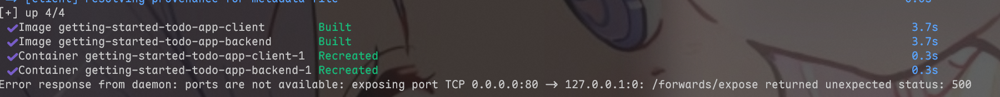
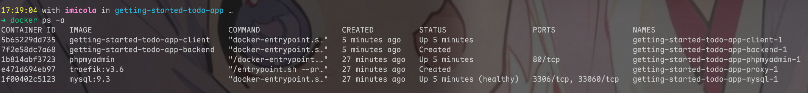
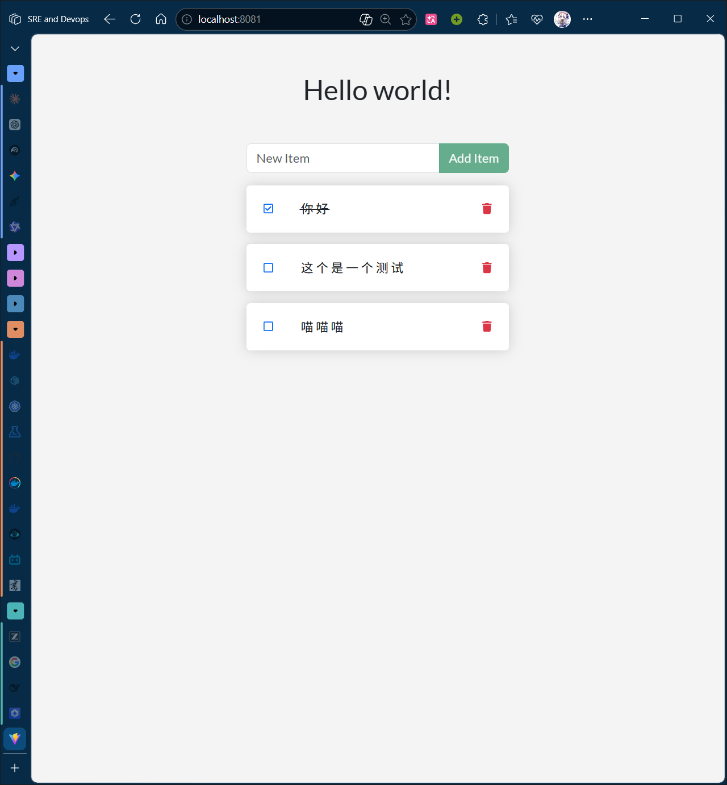
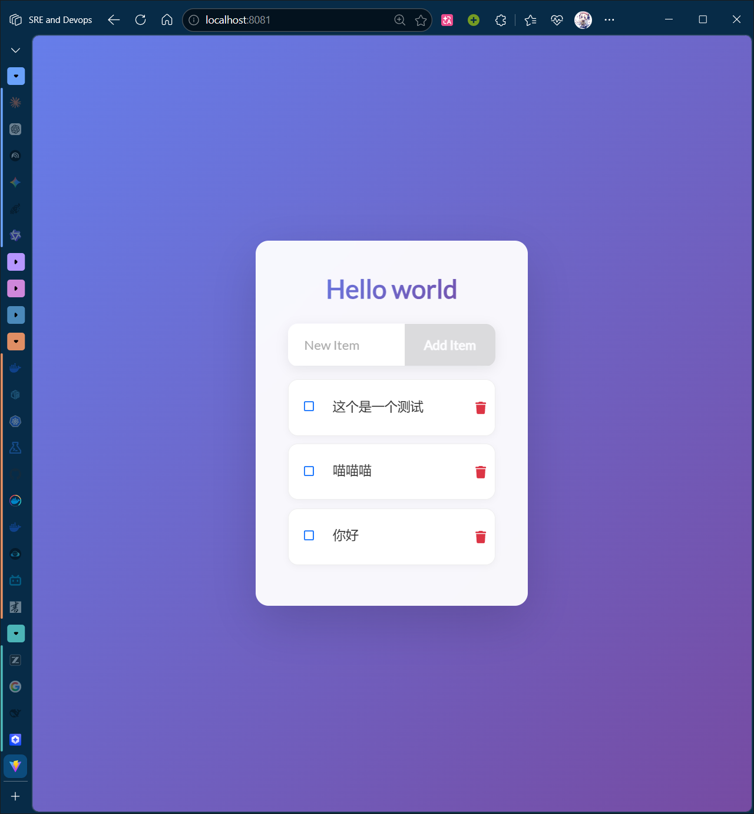

# 说明

> 本项目跑在 WSL(Arch) 下,使用 docker desktop，有一些踩坑指北

现在我们已经安装了 Docker Desktop，准备好进行一些应用程序开发了。具体来说，您将执行以下操作：

- 克隆并启动一个开发项目
- 对后端和前端进行更改
- 立即查看更改

# 启动项目

在开始使用之前，我们需要先将项目配置文件克隆到本地文件

```sh
git clone https://github.com/docker/getting-started-todo-app
```

随后进入项目文件夹

```sh
cd getting-started-todo-app
```

随后我们便可以使用 `docker compose` 启动开发环境

```sh
docker compose watch
```

>[!note]
> 什么是 docker compose ?
> 
> Docker Compose 是一个用于定义和运行多容器 Docker 应用程序的工具。它使用 YAML 文件来配置应用程序的服务、网络和卷等，然后通过一个简单的命令就可以启动整个应用程序的所有服务。
> 
> 简单来说 docker compose 就是将多个容器编排在一起从而实现一个服务的配置工具，通过docker compose我们可以原子化每一个容器，从而不会将所有环境都配置在一个大容器中

然后就是神秘的地方了

- docker会先拉取 `traefik`,`mysql`,`phpmyadmin`这三个镜像，如果你没有较好的网络，可能会导致拉取失败，从小
- 随后是进行 building，会下载一些包比如 `npm` 等，然后进行 `npm install`构建整个容器
- 但是最后在启动后端和 `traefik` 的时候会返回报错



此时我们使用 `docker ps -a` 指令列出所有的容器



显然， `traefik` 和 `backend` 启动失败，imicola这里猜测是因为前面的端口不可用，导致无法后端无法链接到前端，同时没办法通过网络映射到主机端口，导致返回错误，从而中断了容器启动

~~真是复杂的网络环境啊~~

询问 ai 后得知在这个报错中

```sh
Error response from daemon: ports are not available: exposing port TCP 0.0.0.0:80 -> 127.0.0.1:0: /forwards/expose returned unexpected status: 500
```

docker desktop尝试将容器内的端口映射到 Window 主机的80端口中

显然window的80端口是非常繁忙的，通过`netstat -ano | findstr :80`我们可以看到是那个进程在占用这个端口

```pwsh
 netstat -ano | findstr :80
  TCP    0.0.0.0:80             0.0.0.0:0              LISTENING       4
  TCP    10.56.96.140:47703     111.31.2.195:8081      TIME_WAIT       0
  TCP    10.56.96.140:50794     120.233.22.121:8080    ESTABLISHED     20960
  TCP    10.56.96.140:58477     1.95.20.105:80         ESTABLISHED     22052
  TCP    127.0.0.1:8080         0.0.0.0:0              LISTENING       14976
  TCP    [::]:80                [::]:0                 LISTENING       4
```

很好，是PID 4，那大概率是一个系统进程了，查命令管理器发现，PID4对应的是 `System` , ~~那谁也抢不过你了~~

那我们就让端口避让，通过修改 `compose.yaml` 配置可以修改对应端口,在44行处找到proxy post配置，将其修改尝试

```yaml
  proxy:
	image: traefik:v3.6
    command: --providers.docker
    ports:
      - 8081:80  #将80:80
    volumes:
      - /var/run/docker.sock:/var/run/docker.sock
```

接着在命令行中输入 `docker compose watch`,这次构建顺利，此时服务已经启动，在浏览器中输入 `http://localhost:8081/` 即可访问服务

可以看到这是一个 *TODO List* 的Web应用，接下来我们了解如何直接编辑项目获得实时的开发预览



# 环境里有什么

这个 docker 项目里都有什么呢？从高层次来看，有一些容器，每一个容器都为这个web程序提供特定的功能

- React前端: 对应 `getting-started-todo-app-client-1`，一个运行 React 开发服务器的 Node 容器，使用 Vite 构建
- Node后端: 对应 `getting-started-todo-app-backend-1`，后端提供一个API，用于检索，创建，和删除代办事项的能力
- MySQL数据库： 对应 `getting-started-todo-app-mysql-1` 用于存储项目列表的数据库
- phpMyAdmin: 对应 `getting-started-todo-app-phpmyadmin-1` 一个用于与数据库交互的基于Web的界面，可通过 [http://db.localhost](http://db.localhost/)访问
- Traefik 代理: 对应 `getting-started-todo-app-proxy-1` 一个应用代理程序，可以将请求路由到正确的服务，它将所有针对 `localhost/api/*` 的请求发送到后端，将针对 `localhost/*` 的请求发送到前端，然后将针对 `db.localhost` 的请求发送到 phpMyAdmin。这使得可以使用主机一个端口访问所有应用程序（而不是为每个服务使用不同的端口）。

在这个环境中，作为开发者的我们无需安装或配置任何服务，无需填充数据库架构，无需配置数据库凭据，也无需其他操作。我们只需要 Docker Desktop。其余的一切都会自动运行。(~~难说~~)

# 对应用进行更改

使用 docker 进行开发也能获得如同原生开发一般即时观测的效果，我们只需要和往常一样修改项目中的内容即可，下面是一些例子

## 后端 - 更改问候语

页面顶部的问候语通过 `/api/greeting` 进行填充，目前它总是只返回 "Hello world",如果想改变它，我们可以在 `backend/src/routes/getGreeting.js`文件中修改这个js文件顶部的 const 变量，当然我们也可以将其变化为一个数组吗，然后随机调用

```js
const GREETING = [
    "Hello world",
    "喵喵喵",
    "Edit with docker",
];

module.exports = async (req, res) => {
    res.send({
        greeting: GREETING[Math.floor(Math.random() * GREETING.length)],
    });
};

```

刷新界面即可看到，已经更新

![[Pasted image 20260327181221.png]]

---

## 前端 - 界面美化

我觉得这个界面不好看怎么办？ 让ai进行美化！(~~或者自己干~~)

前端的文件位于 `/client` 中，按正常思路对前端进行美化，刷新页面观察效果即可



~~依旧ai审美~~

# 关闭docker

对于 docker compose,我们可以使用 `docker compose down` 将容器彻底删除 (不会删除镜像)，这是推荐的方式，可以释放容器的空间，因为保留了镜像，下次使用的时候直接构建就可以了

如果不想删除容器，方便下次快速启动，我们可以使用 `docker compose stop` 命令